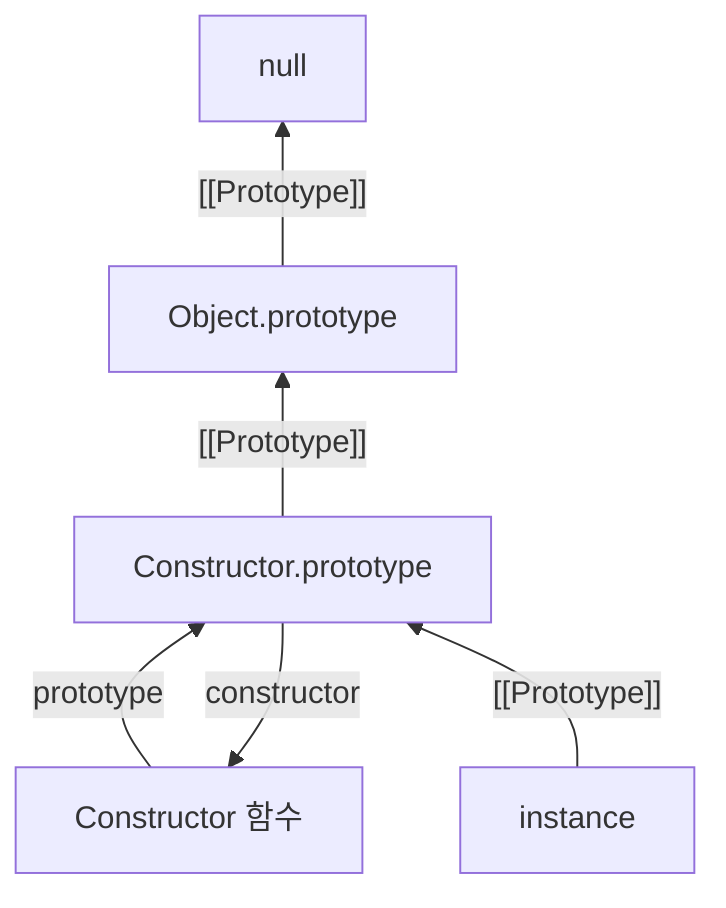

## ✍🏻 핵심 정리

> - `new`로 생성된 인스턴스는 `[[Prototype]]`을 통해 생성자 함수의 `prototype` 객체에 연결된다.
> - 프로토타입은 연쇄적으로 연결되어 있고 해당 체인을 따라 프로퍼티를 탐색한다.

## 프로토타입이란?

자바스크립트는 **프로토타입 기반 언어**이다.  
클래스 기반 언어에서의 상속과는 달리, 객체들이 서로 연결되어 프로퍼티와 메소드를 공유하는 방식을 취한다.

### 1. 프로토타입의 기본 구조

어떤 생성자 함수(`Constructor`)를 `new` 연산자와 함께 호출하면 인스턴스가 생성되는데, 이때 다음과 같은 연결 구조가 만들어진다.



- 생성된 인스턴스에는 `[[Prototype]]`이라는 내부 슬롯이 생긴다.
- 이 `[[Prototype]]`은 **`Constructor.prototype` 객체를 참조**한다.
- prototype 자체가 객체이기 때문에 프로토타입 체인의 최상단은 `Object.prototype`이 된다.

<!-- prettier-ignore-start -->

> **prototype vs [[Prototype]]**
>
> - `prototype`: 생성자 함수가 가지는 객체로, 여러 인스턴스들이 공유할 메소드를 담는 **공유 객체**이다.
> - `[[Prototype]]`: 인스턴스가 가지는 **내부 링크**이다. 직접 접근할 수 없으며, `__proto__`(레거시, 비권장)나 `Object.getPrototypeOf()`를 통해 확인할 수 있다.
{: .prompt-info }

<!-- prettier-ignore-end -->

---

## 프로퍼티 탐색과 this

### 1. 프로토타입 체이닝 (Prototype Chaining)

객체에서 어떤 프로퍼티나 메소드에 접근하려 할 때, 해당 객체에 찾는 값이 없으면 `[[Prototype]]`이 가리키는 링크를 따라 상위 프로토타입 객체를 검색한다. 이를 **프로토타입 체이닝**이라고 한다.

```js
function Person(name) {
  this.name = name;
}

Person.prototype.getName = function () {
  return this.name;
};

const yeeun = new Person("yeeun");

// 1. yeeun 객체 내부에 getName이 있는지 확인 -> 없음
// 2. yeeun.[[Prototype]] (즉, Person.prototype)에 getName이 있는지 확인 -> 있음
console.log(yeeun.getName()); // 'yeeun'
```

### 2. this 바인딩

프로토타입 체인을 통해 메소드를 찾았더라도, **메소드 내부의 `this`는 항상 메소드를 실제로 호출한 객체**를 가리킨다.

```js
yeeun.getName(); // 'yeeun' (this === yeeun)
yeeun.__proto__.getName(); // undefined (this === yeeun.__proto__ === Person.prototype)
```

`yeeun.__proto__` 객체 내부에는 name이라는 프로퍼티가 없으므로 undefined가 반환된다.  
이처럼 this가 어디에 바인딩되느냐에 따라 결과가 달라짐을 유의해야 한다.

---

## constructor 프로퍼티

모든 `prototype` 객체 내부에는 `constructor`라는 프로퍼티가 존재한다.  
이는 원래의 생성자 함수(자기 자신)를 참조하며, 인스턴스로부터 자신의 원형이 무엇인지 알 수 있게 해준다.

```js
console.log(yeeun.constructor === Person); // true (프로토타입 체이닝)
console.log(yeeun.__proto__.constructor === Person); // true
```

그러나 constructor는 일반적인 프로퍼티이므로 덮어쓸 수 있다.  
프로토타입 관계를 혼동하지 않으려면 변경하지 않는 것이 좋지만, 변경하더라도 참조하는 대상이 변경될 뿐 인스턴스의 실제 타입이 바뀌는 것은 아니다.

<!-- prettier-ignore-start -->

> primitive 값은 객체가 아니므로 constructor 접근 시에는 임시 wrapper 객체가 생성되고 (boxing)  
> constructor를 변경해도 값에는 반영되지 않는다.
{: .prompt-info }

<!-- prettier-ignore-end -->

---

## 메소드 오버라이드 (Method Override)

인스턴스에 프로토타입 메소드와 동일한 이름의 메소드를 직접 정의하면, 인스턴스의 메소드가 호출된다.  
인스턴스의 메소드를 먼저 탐색하고, 프로토타입 체인을 따라 탐색하기 때문이다.  
물론 프로토타입 메소드는 유지된다.

```js
const yeeun = new Person("yeeun");

yeeun.getName = function () {
  return "Instance: " + this.name;
};

console.log(yeeun.getName()); // 'Instance: yeeun'
console.log(yeeun.__proto__.getName.call(yeeun)); // 'yeeun' (원래 메소드 호출 가능, call로 this 바인딩 필요)
```

---

## 💼 실무 연결 포인트

- 메모리 효율: 인스턴스마다 메소드를 복사하지 않고 `prototype`에 한 번만 정의하면 대규모 인스턴스 생성 시 메모리를 크게 아낄 수 있다.
- 클래스 문법의 이해: ES6의 `class`는 내부적으로 프로토타입 체인을 사용한다. 동작 원리를 이해해야 복잡한 상속 구조에서의 버그를 방지할 수 있다.
- Object.create(null): `Object.prototype`을 상속받지 않는 순수한 해시맵 객체가 필요할 때 유용하다.

---

## 🗣️ 면접 대비 Q&A

**Q1. 프로토타입 체인이란 무엇인가요?**

객체의 `[[Prototype]]`이 다른 객체를 연쇄적으로 참조하는 구조를 말합니다. 어떤 프로퍼티에 접근할 때 해당 객체에 없으면 이 체인을 따라 올라가며 탐색합니다. 모든 객체 체인의 최상단은 `Object.prototype`이며, 이곳에도 없으면 `undefined`를 반환합니다.

**Q2. `prototype`과 `[[Prototype]]`, `__proto__`의 차이에 대해 설명해보세요.**

`prototype`은 생성자 **함수**가 가지는 프로퍼티로, 인스턴스들이 공유할 메소드를 담는 공유 객체입니다. `[[Prototype]]`은 모든 **객체**가 가지는 내부 슬롯으로, 생성 시 `Constructor.prototype`을 가리키도록 설정됩니다. `__proto__`는 `[[Prototype]]`에 접근하기 위한 accessor 프로퍼티로, 자신의 부모인 프로토타입 객체를 가리키는 실제 링크입니다. 다만 `__proto__`를 통해 접근하는 것보다 `Object.getPrototypeOf()` 등의 메소드를 활용하는 방식이 권장됩니다.

**Q3. 메소드 오버라이드와 프로토타입 메소드의 관계를 설명하세요.**

메소드 오버라이드란 인스턴스에 프로토타입 메소드와 동일한 이름의 메소드를 정의하여, 기존 메소드를 덮어쓰는 것을 말합니다. 자바스크립트는 프로토타입 체인을 따라 가장 먼저 발견되는 프로퍼티에 접근하기 때문에, 인스턴스 메소드가 호출되면서 프로토타입 메소드는 가려지게 됩니다. 이러한 현상을 **프로퍼티 쉐도잉(Property Shadowing)**이라고 합니다. 이때 프로토타입 메소드가 삭제되는 것은 아니므로 `__proto__`를 통해 접근할 수 있습니다. 다만, 프로토타입에 정의된 메소드를 직접 호출하면 메소드 내부의 this가 인스턴스가 아닌 프로토타입 객체를 가리키게 됩니다. 따라서 `.call(instance)`을 사용하여 this를 인스턴스로 명시적으로 바인딩해 주어야 원본 메소드가 의도대로 동작합니다.

---

## 💡 최종 인사이트

자바스크립트의 프로토타입은 언어 자체가 객체를 연결하는 근본적인 방식이다.  
객체를 만들고, 프로토타입으로 연결하고, 그 체인을 따라 탐색하는 과정은 자바스크립트의 모든 객체 지향적 동작의 기반이 된다.  
`class` 문법을 쓰더라도 내부에서는 여전히 이러한 방식으로 동작하고 있다.
