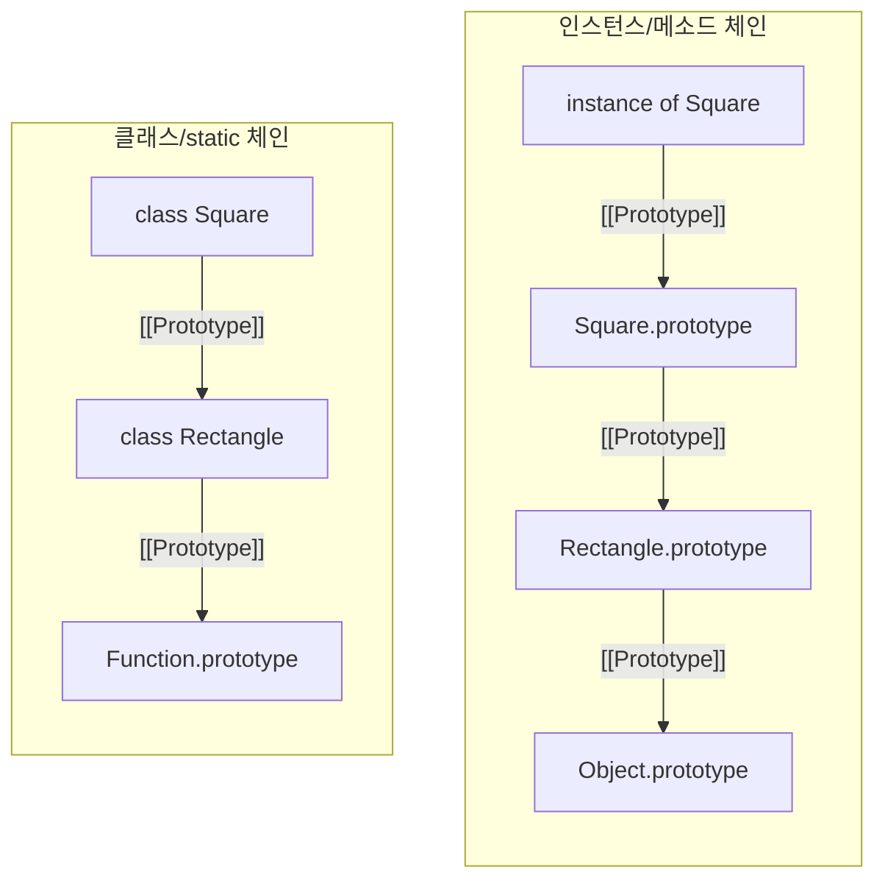

## ✍🏻 핵심 정리

> - 자바스크립트의 클래스는 Syntactic Sugar일 뿐이며, 실제 동작은 프로토타입 체이닝을 기반으로 한 상속 구조이다.

## 클래스와 인스턴스

클래스는 공통 요소를 지니는 집단을 분류하기 위한 추상적인 개념이고, 인스턴스는 그 클래스의 조건을 만족하는 구체적인 객체를 의미한다.

### 자바스크립트의 클래스 모델

자바스크립트는 프로토타입 기반 언어이기 때문에, 생성자 함수가 `prototype`을 참조하고 인스턴스가 `[[Prototype]]`으로 이를 연결하는 구조 자체가 클래스 역할을 수행한다.

- **Static Member**: 생성자 함수(클래스)에 직접 정의된 멤버. 인스턴스에서는 접근할 수 없고 클래스 이름으로만 접근 가능하다.
- **Instance (Prototype) Member**: `prototype` 객체에 정의된 멤버. 프로토타입 체이닝을 통해 인스턴스가 마치 자신의 것처럼 접근할 수 있다.

---

## 상속 구현 (ES5 vs ES6)

### 1. ES5에서의 상속

ES5에서는 클래스 개념이 없었기 때문에 프로토타입 체인을 직접 조작하여 상속을 흉내 냈다.

```js
function Parent(name) {
  this.name = name;
}

Parent.prototype.getName = function () {
  return this.name;
};

function Child(name) {
  Parent.call(this, name); // 1. 부모 생성자 호출
}

// 2. 프로토타입 체인 연결 (Object.create 활용)
Child.prototype = Object.create(Parent.prototype);
// 3. 꼬인 constructor 복구
Child.prototype.constructor = Child;
```

단순히 `Child.prototype = new Parent()`를 하면 부모 인스턴스의 불필요한 속성까지 포함되는 문제가 있어,  
중간에 매개체(Bridge)를 두거나 `Object.create`를 사용하는 것이 정석이다.

### 2. ES6에서의 클래스 상속

ES6에서 도입된 `class` 문법은 위와 같은 복잡한 과정을 직관적인 키워드로 해결해준다.

```js
class Rectangle {
  constructor(width, height) {
    this.width = width;
    this.height = height;
  }

  getArea() {
    return this.width * this.height;
  }
}

class Square extends Rectangle {
  constructor(width) {
    // this.name = "정사각형"; // ReferenceError: super() 호출 전엔 this 접근 불가
    super(width, width); // 부모 생성자 실행
    this.name = "정사각형"; // super() 호출 후에 this 접근 가능
  }
}
```

- `extends`: 프로토타입 체인을 자동으로 연결해준다.
- `super`: 부모의 `constructor`나 메소드에 접근할 수 있게 해준다.

상속 시에는 인스턴스 메소드뿐만 아니라 클래스 자체(Static)도 체인으로 연결된다.



---

## 🔍 코드로 확인하기

### Static vs Prototype 멤버 구분

```js
class Person {
  constructor(name) {
    this.name = name;
  }

  // Prototype Method
  sayHi() {
    console.log("Hi, " + this.name);
  }

  // Static Method
  static isPerson(obj) {
    return obj instanceof Person;
  }
}

const p = new Person("yeeun");
p.sayHi(); // OK
Person.isPerson(p); // OK
// p.isPerson(p); // TypeError: static member는 인스턴스에서 접근 불가
```

---

## 💼 실무 연결 포인트

- 데이터 계층 구조: 공통 로직은 상위 클래스의 `prototype`에, 개별 상태는 인스턴스의 `this`에 저장하여 효율적으로 관리한다.
- `class` 키워드를 사용하더라도 내부적으로는 `prototype` 링크가 생성된다. 상속이 깊어질수록 체이닝 비용이 발생할 수 있음을 인지해야 한다.
- React 등 프레임워크: 클래스형 컴포넌트 시절에는 `super(props)` 호출 등이 필수적이었는데, 이 역시 자바스크립트의 상속 모델을 따르기 때문이었다.

---

## 🗣️ 면접 대비 Q&A

**Q1. 자바스크립트에서 클래스는 어떻게 동작하나요?**

자바스크립트에서 클래스는 별도의 객체 모델이라기보다는, 프로토타입 기반 상속을 더 쉽게 쓰도록 만든 문법입니다. 실제로는 생성자 함수와 prototype을 기반으로 동작하고, 인스턴스는 생성자 함수의 prototype을 `[[Prototype]]`으로 참조하게 됩니다. 그래서 클래스 문법을 사용하더라도 내부적으로는 프로토타입 체이닝을 통해 메소드를 공유하고 상속이 이루어집니다.

**Q2. 자바스크립트에서 상속은 어떻게 구현되나요? (ES5 vs ES6)**

자바스크립트 상속의 핵심은 프로토타입 체인을 연결하는 것입니다. ES5에서는 이 과정을 직접 구현해야 해서, 부모 생성자를 `call`로 실행해 인스턴스를 초기화하고, `Object.create()`로 prototype을 연결하는 방식으로 처리했습니다. ES6의 `extends`는 이 과정을 자동화하고, static member 또한 상속됩니다. ES5에서는 부모 `prototype`의 메소드만 상속되지만, ES6의 `extends`는 자식 클래스 자체의 `[[Prototype]]`을 부모 클래스로 설정하여 부모의 static 메소드까지 체이닝에 포함시킵니다. 또한 `super()`를 통해 부모의 생성자 로직을 안전하게 호출할 수 있다는 점이 다릅니다.

**Q3. `super` 키워드는 어떤 역할을 하나요?**

`super`는 상황에 따라 두 가지로 사용됩니다. 자식 클래스는 스스로 `this`를 생성할 수 없고 부모 클래스에게 생성을 위임하기 때문에, 생성자에서 부모 클래스의 생성자를 실행하여 `this`를 초기화하고 전달받는 역할을 합니다. 일반 메소드에서 사용하면 부모 클래스의 prototype 메소드에 접근할 수 있게 해줍니다. 특히 자식 클래스에서는 `this`를 사용하기 전에 반드시 `super()`를 먼저 호출해야 한다는 점이 중요합니다.

**Q4. 클래스에서 메소드 정의 방식에 따른 차이는?**

클래스에서 일반적인 메소드 형태로 정의하면 해당 메소드는 prototype에 등록되어 모든 인스턴스가 공유하게 됩니다. 반면에 클래스 필드 문법으로 화살표 함수를 사용하면 메소드가 인스턴스마다 새로 생성됩니다. 그래서 메모리 효율이나 상속 관점에서는 prototype에 정의되는 일반 메소드 방식을 사용하는 것이 더 적절합니다.

---

## 💡 최종 인사이트

자바스크립트에서 클래스는 다른 언어처럼 독립적인 구조가 아니라, 함수와 객체를 기반으로 만들어졌으며,  
복잡한 프로토타입 기반 상속을 개발자가 더 다루기 쉬운 형태로 추상화해준 도구이다.
