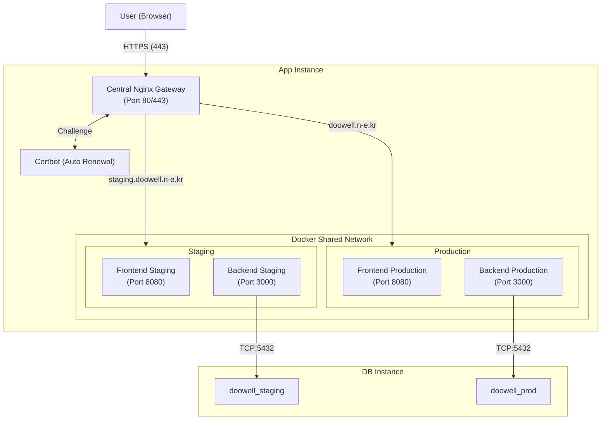

기존에 팀 프로젝트로 진행되던 뚜웰 프로젝트를 개인적으로 더 발전시키기 위해 인프라를 간소화하기로 결정했다.  
기존에는 NCP를 활용하여 앱 서버와 DB 서버를 두고 아래와 같은 아키텍처로 구성했었다.



아무래도 복잡하게 구성되었기 때문에, 혼자서 프로젝트를 진행할 때에는 관리와 비용 측면에서 간소화하는 것이 좋을 것 같아서 Supabase와 Vercel 기반으로 마이그레이션 하기로 결정하였다.

Supabase를 선택한 이유는 크게 세 가지다.

1. PostgreSQL 기반: **기존에 NCP + PostgreSQL 조합을 사용하고 있었기 때문**에, TypeORM 엔티티와 마이그레이션 파일을 그대로 재사용할 수 있었다.
2. 인프라 관리 불필요: 직접 DB 서버를 운영하는 대신 **Supabase가 PostgreSQL 인스턴스를 관리**해준다. Connection Pooler, 백업, 모니터링까지 기본 제공된다.
3. 무료 플랜의 다양한 기능: DB뿐 아니라 Auth, Storage, Realtime 기능까지 무료 플랜에 포함되어 있어, **향후 기능 확장 시 별도 서비스를 붙일 필요가 없**다.

이번 포스팅에서는 NestJS + TypeORM 기반의 백엔드 환경을 유지하면서, 데이터베이스를 Supabase로 마이그레이션한 과정을 기록하려고 한다.

## 1. Supabase 프로젝트 만들기

Supabase 홈페이지에 들어가서 프로젝트를 간단하게 만들 수 있다. ([참고 링크](https://sooncoding.tistory.com/288))  
프로젝트를 생성할 때 Security 옵션이 있는데, 나는 아래 설정을 모두 활성화했다.

- Enable Data API: Supabase가 내부적으로 사용하는 PostgREST를 통해 데이터베이스에 HTTP로 직접 접근할 수 있게 해주는 옵션이다. 비활성화하면 반드시 백엔드 서버를 거쳐야만 DB에 접근할 수 있다. 향후 프론트엔드에서 Supabase 클라이언트를 직접 쓸 가능성을 고려해 활성화해뒀다.
- Automatically expose new tables: 새로 생성되는 테이블을 자동으로 Data API(PostgREST)에 노출시키는 옵션이다. 비활성화하면 테이블을 추가할 때마다 수동으로 공개 여부를 설정해야 한다.
- Enable automatic RLS: Row Level Security의 약자로, PostgreSQL이 제공하는 행 단위 접근 제어 기능이다. 활성화하면 테이블을 생성할 때 자동으로 RLS가 켜지고, 별도의 Policy를 정의하기 전까지는 모든 접근이 차단된다. 위 옵션을 모두 켠 상태에서 RLS까지 없다면 누구나 전체 데이터를 조회·수정할 수 있기 때문에, 세 옵션은 같이 설정해야 의미가 있다.

참고로 Supabase 무료 플랜인 경우 2개의 프로젝트가 최대이다.

## 2. 환경 변수(.env) 설정

기존에 사용하던 환경 변수 정보를 Supabase의 **Connection Pooler** 주소로 변경했다.


프로젝트 상단에 보면 `Connect` 버튼이 있다.  
해당 버튼을 누르면 오른쪽에 아래와 같은 모달이 뜨는데, 여기서 `Direct` 탭을 선택하고 `Transaction pooler`를 선택해줬다.

<!-- prettier-ignore-start -->
> Supabase는 연결 방식으로 `Direct`, `Transaction`, `Session` 세 가지를 제공한다.  
> TypeORM은 자체 커넥션 풀을 관리하므로, Supabase 쪽에서 추가적인 세션을 점유하지 않도록 Transaction Pooler를 사용하는 것이 권장된다. Session Pooler는 prepared statement를 유지하지만 포트가 5432로 직접 연결과 동일해 혼동될 수 있고, Direct는 Supabase 무료 플랜에서 동시 연결 수 제한에 빠르게 도달할 수 있다.
{: .prompt-info }
<!-- prettier-ignore-end -->


선택해주면 하단에 해당 프로젝트에 대한 `Connection string` 정보가 있다. 이 부분을 환경 변수에 업데이트 해주면 된다.


혹시 비밀번호를 잊었을 경우에는 `Reset password`를 사용하면 쉽게 해결할 수 있다.

```ini
# .env.development.local
DB_HOST=aws-1-ap-southeast-2.pooler.supabase.com
DB_PORT=6543
DB_USER=postgres.[YOUR_PROJECT_ID]
DB_PASS=[YOUR_DB_PASSWORD]
DB_NAME=postgres
```

## 3. 마이그레이션 진행

나는 이전에 이미 마이그레이션 파일과 스크립트 설정이 되어 있는 상태였기 때문에 간단하게 마이그레이션 스크립트를 실행하면 되었는데, 그 과정에서 일부 에러가 있었다.

### 트러블슈팅 1: 모노레포 패키지 참조 에러

마이그레이션을 실행할 때 `@web24/batch`나 `@web24/shared` 같은 로컬 패키지를 찾지 못하는 문제가 발생했다.

```
Error: Cannot find module '@web24/shared'
```

모노레포 구조에서 공통 패키지를 빌드하지 않은 상태로 마이그레이션 CLI를 실행하면, TypeScript 소스를 참조하는 로컬 패키지의 `dist` 디렉토리가 없어 모듈을 찾지 못한다.  
공통 패키지를 먼저 빌드한 후 마이그레이션을 재실행하여 해결하였다.

```bash
# 공통 패키지 빌드 먼저
pnpm build:shared && pnpm build:batch

# 그 다음 마이그레이션 실행
pnpm --filter @web24/backend migration:run
```

### 트러블슈팅 2: uuidv7() 함수 부재

기존에 PostgreSQL v18을 사용하고 있어서 UUID v7(`uuidv7()` 내장 함수)을 기본 키로 활용하고 있었는데, Supabase가 현재 PostgreSQL v17.6을 사용하고 있어 해당 함수가 없었다.

```
ERROR: function uuidv7() does not exist
```

마이그레이션 파일 내에서 `DEFAULT uuidv7()`으로 선언된 컬럼들이 모두 실패하는 상황이었다.  
Supabase SQL Editor에서 직접 `uuidv7()` 함수를 정의하는 방식으로 해결했다. 함수 내용은 AI의 도움을 받았다.

```sql
CREATE OR REPLACE FUNCTION uuidv7() RETURNS uuid AS $$
DECLARE
  v_time timestamp with time zone:= clock_timestamp();
  v_gts bigint;
  v_seq bigint;
  v_uuid_bin bytea;
BEGIN
  v_gts:= (EXTRACT(EPOCH FROM v_time) * 1000)::bigint;
  v_seq:= (random() * 4095)::bigint;
  v_uuid_bin:= decode(
    lpad(to_hex(v_gts), 12, '0') ||
    '7' ||
    lpad(to_hex(v_seq), 3, '0') ||
    lpad(to_hex((random() * 9223372036854775807)::bigint), 16, '0'),
    'hex'
  );
  RETURN encode(v_uuid_bin, 'hex')::uuid;
END;
$$ LANGUAGE plpgsql VOLATILE;
```

해당 SQL을 실행하고 나서 다시 마이그레이션을 실행해보니 문제 없이 완료되었다.


### 트러블슈팅 3: 로그인할 때 Invalid UUID 에러 발생

DB 마이그레이션도 성공하고 서버도 정상적으로 켜졌으나, 브라우저에서 로그인을 시도하자 화면에 `400 Bad Request`와 함께 `invalid uuid` 에러가 발생했다.

#### 1. 원인: Postgres와 Zod의 차이

Supabase의 PostgreSQL은 32자리 16진수 문자열이기만 하면 유효한 UUID로 간주하여 에러 없이 테이블에 저장한다.  
하지만 프론트/백엔드 공통 스키마에 정의된 Zod는 표준 규격(RFC 4122 / RFC 9562)을 검사하고 있었다. (`z.uuid({ version: 'v7' })`)  
표준 규격에 따르면 UUID v7은 4번째 그룹의 첫 문자(19번째 문자)가 **버전 변형(Variant) 비트**를 나타내는 **8, 9, a, b** 중 하나여야 한다.  
하지만 이전의 `uuidv7()` 함수는 임의의 난수로 채우다 보니 Zod 검증에 걸려 400 에러가 발생한 것이다.

#### 2. 해결: Variant 비트 강제 주입

```sql
CREATE OR REPLACE FUNCTION uuidv7() RETURNS uuid AS $$
DECLARE
  v_bytes bytea;
  v_gts bigint;
BEGIN
  v_gts := (EXTRACT(EPOCH FROM clock_timestamp()) * 1000)::bigint;
  v_bytes := gen_random_bytes(16);

  -- bytes 0-5: 48비트 타임스탬프 (big-endian)
  v_bytes := set_byte(v_bytes, 0, ((v_gts >> 40) & 255)::int);
  v_bytes := set_byte(v_bytes, 1, ((v_gts >> 32) & 255)::int);
  v_bytes := set_byte(v_bytes, 2, ((v_gts >> 24) & 255)::int);
  v_bytes := set_byte(v_bytes, 3, ((v_gts >> 16) & 255)::int);
  v_bytes := set_byte(v_bytes, 4, ((v_gts >> 8) & 255)::int);
  v_bytes := set_byte(v_bytes, 5, (v_gts & 255)::int);

  -- byte 6 상위 4비트: version = 7 (0111xxxx)
  v_bytes := set_byte(v_bytes, 6, (get_byte(v_bytes, 6) & 15) | 112);

  -- byte 8 상위 2비트: variant = 10 (10xxxxxx)
  v_bytes := set_byte(v_bytes, 8, (get_byte(v_bytes, 8) & 63) | 128);

  RETURN encode(v_bytes, 'hex')::uuid;
END;
$$ LANGUAGE plpgsql VOLATILE;
```

이전 함수와 비교해 달라진 점은 크게 두 가지다.

1\. 난수 생성 방식을 `random()`에서 `gen_random_bytes(16)`으로 교체했다.  
`random()`은 PostgreSQL 내부의 유사난수(pseudorandom) 생성기를 사용하는 반면, `gen_random_bytes()`는 운영체제의 암호학적 난수 소스(`/dev/urandom` 등)를 사용한다.  
UUID를 외부에 노출하는 식별자로 사용할 때 예측 가능성을 낮추려면 후자가 낫다.

2\. 비트 연산으로 version과 variant를 명시적으로 세팅한다.  
이전 함수는 16진수 문자열을 그냥 이어 붙이는 방식이라 UUID의 19번째 문자(variant nibble)가 `0` ~ `f` 중 완전히 랜덤하게 결정되었다.  
RFC 9562 기준으로 유효한 값은 8, 9, a, b뿐이므로, 약 75% 확률로 규격에 맞지 않는 UUID가 생성되어 Zod 검증에서 실패했다.  
새 함수는 `gen_random_bytes()`로 만든 16바이트에서 byte 8의 상위 2비트만 `10`으로 마스킹하여 덮어쓰기 때문에, variant nibble은 항상 8, 9, a, b 중 하나가 되면서 나머지 6비트는 온전히 랜덤을 유지한다.

이 함수를 Supabase SQL Editor에서 실행한 뒤 로그인을 시도하니 정상적으로 동작했다.
