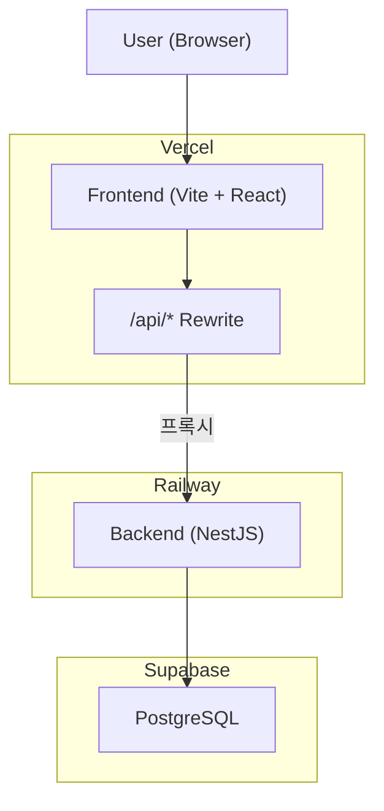

[지난 포스팅](../뚜웰-1-supabase로-db-마이그레이션)에서 DB를 Supabase로 이전했다.  
이번에는 NCP 앱 서버(Docker + Nginx + SSH)를 없애고 프론트엔드와 백엔드를 각각 다른 플랫폼으로 이전하는 과정을 기록해봤다.

## 1. 플랫폼 선택

### 프론트엔드: Vercel

[Vercel](https://vercel.com/)은 Next.js를 만든 회사(회사 이름도 Vercel이다)에서 운영하는 프론트엔드 전용 배포 플랫폼이다.  
Git 저장소를 연결하면 push할 때마다 자동으로 빌드 및 배포되고, PR마다 미리보기(Preview) URL이 생성된다.  
정적 파일은 CDN에 캐싱되어 서빙되고, API 라우트나 서버 함수는 Serverless 형태로 요청이 올 때만 실행된다.  
즉 상시 켜져 있는 서버가 아니라 요청 단위로 뜨고 꺼지는 구조라서, 트래픽이 없을 때는 비용이 들지 않는다는 장점이 있지만 그만큼 실행 시간에 제약(무료 플랜 기준 함수당 10초)이 있다.

뚜웰 프로젝트는 Vite + React SPA인데, 아래와 같은 이유로 Vercel이 자연스러운 선택이었다.

1. 정적 자산 최적화: 빌드 결과물이 순수 정적 파일(HTML/JS/CSS)이라 서버리스 함수 실행 시간 제한이 문제되지 않는다. 오히려 전 세계 CDN에 캐싱되어 서버 위치와 무관하게 빠르게 응답한다.
2. Git 기반 자동 배포: main에 push하면 자동으로 빌드·배포되고, PR을 열면 미리보기 URL이 생성돼 배포 전에 확인할 수 있다.
3. rewrites로 API 프록시와 SPA 라우팅을 한 번에 해결: 별도 Nginx 설정 없이 `vercel.json` 하나로 `/api/*` 프록시와 클라이언트 라우팅(모든 경로를 index.html로 fallback)을 처리할 수 있다.
4. 무료 플랜으로 충분: 정적 서빙 위주라 트래픽이 많지 않은 사이드 프로젝트 단계에서는 비용 부담이 없다.

### 백엔드: Railway

[Railway](https://railway.app/)는 Dockerfile이나 Nixpacks를 기반으로 컨테이너를 상시 실행해주는 PaaS(Platform as a Service)다.  
Heroku와 유사한 사용성을 지향하는데, Git 저장소를 연결하면 자동으로 이미지를 빌드해 배포해주고, 대시보드에서 환경 변수, 도메인, 로그, 리소스 사용량을 관리할 수 있다.  
Vercel과 달리 프로세스가 서버리스가 아니라 컨테이너 단위로 계속 떠 있기 때문에, 백그라운드 스케줄러나 오래 걸리는 작업을 실행하는 데 적합하다.

처음에는 Vercel에 백엔드까지 올리는 것도 고려했다. 하지만 두 가지 이유로 Railway를 선택했다.

1. Cron Job: `BatchModule`이 `@nestjs/schedule`로 푸시 알림 발송과 통계 집계를 주기적으로 실행한다. Vercel은 서버리스라 프로세스가 상시 실행되지 않아 스케줄러가 동작하지 않는다.
2. AI 타임아웃: LangGraph로 LLM을 최대 3번 순차 호출하는 구조라 Vercel 무료 플랜의 10초 함수 실행 제한을 초과할 수 있다.

Railway는 Docker 이미지를 상시 실행해주는 플랫폼으로, 기존 Dockerfile을 그대로 사용할 수 있어 코드 변경 없이 전환이 가능했다.  
Railway는 무료 플랜을 제공하고 있지는 않지만, 신규 회원가입을 하면 5달러 크레딧을 주고 있어서 금전적인 부담 또한 크지 않았다.

최종 아키텍처는 아래와 같다.



## 2. 코드 변경

### vercel.json

모노레포 빌드 설정과 라우팅을 담당하는 `vercel.json`을 루트에 추가했다.

```json
{
  "buildCommand": "pnpm --filter @web24/shared build && pnpm --filter @web24/frontend build",
  "outputDirectory": "apps/frontend/dist",
  "rewrites": [
    {
      "source": "/api/:path*",
      "destination": "https://web24backend-production.up.railway.app/api/:path*"
    },
    {
      "source": "/(.*)",
      "destination": "/index.html"
    }
  ]
}
```

`/api/*` 요청을 Railway로 프록시하기 때문에 브라우저 입장에서는 프론트와 백엔드가 같은 도메인으로 보인다.  
덕분에 CORS 설정이 필요 없고 세션 쿠키도 별도 처리 없이 동작한다.

### CORS 활성화

기존 코드에서 CORS가 개발 환경에서만 활성화되어 있었는데, Google OAuth 리다이렉트나 향후 Vercel only 전환을 대비해 프로덕션에서도 활성화했다.

```typescript
// 변경 전
if (process.env.NODE_ENV === 'development') {
  app.enableCors({ origin: process.env.FE_URL ?? 'http://localhost:5173', ... });
}

// 변경 후
app.enableCors({
  origin: process.env.FRONTEND_URL ?? 'http://localhost:5173',
  credentials: true,
  methods: 'GET, POST, PUT, PATCH, DELETE, OPTIONS',
});
```

## 3. 트러블슈팅

### Railway 1: pnpm을 찾을 수 없음

```
The executable pnpm could not be found.
```

Railway가 Dockerfile 대신 자체 빌드 시스템인 Nixpacks로 빌드를 시도하면서 발생한 문제였다.  
`railway.toml`을 추가해 Dockerfile 빌드를 명시적으로 지정했다.

```toml
[build]
builder = "DOCKERFILE"
dockerfilePath = "apps/backend/Dockerfile"
```

### Railway 2: Start Command 충돌

같은 에러가 계속 났는데 이번에는 Build 단계가 아닌 **Create Container** 단계에서였다.  
Railway의 diagnosis 기능을 통해 원인을 분석해보니 Railway가 대시보드에서 자동으로 설정한 Start Command(`pnpm --filter @web24/backend start`)가 Dockerfile의 `CMD ["node", "dist/main"]`을 덮어쓰고 있었다.  
런타임 이미지에는 pnpm이 없기 때문에 실패한다.  
Railway 대시보드 -> Settings -> Deploy -> Start Command를 비워두면 Dockerfile의 CMD를 그대로 사용한다.

### Railway 3: @web24/batch 빌드 누락

백엔드 빌드 자체가 실패했는데, `@web24/batch` 패키지가 Dockerfile에서 빠져 있었다.  
`@web24/shared`는 포함되어 있었지만 `@web24/batch`는 누락된 상태였다.

```dockerfile
# 추가된 부분
COPY packages/batch/package.json packages/batch/package.json
...
COPY packages/batch packages/batch
...
RUN pnpm -F @web24/batch build
```

runner 스테이지의 COPY와 chown에도 동일하게 추가했다.

### Vercel 1: Output Directory를 찾을 수 없음

```
No Output Directory named "dist" found after the Build completed.
```

Vercel에서 레포지토리를 import할 때 Root Directory를 `apps/frontend`로 설정했더니 `vercel.json`이 적용되지 않아 발생한 문제였다.  
Root Directory를 레포 루트로 변경하니 해결됐다.  
`apps/frontend`로 설정하면 `vercel.json`의 rewrites(API 프록시, SPA 라우팅)가 동작하지 않기 때문에 루트를 기준으로 설정하는 것이 맞다.

### Google OAuth: 세션 쿠키 도메인 불일치

게스트 로그인 후 구글 연동 시도 시 401 에러가 발생했다.  
원인은 OAuth 콜백 URL이 Railway 도메인으로 설정되어 있어서 발생하는 세션 쿠키 불일치였다.

#### 문제 흐름

1. 게스트 유저가 `/api/auth/google` 요청 -> Vercel 프록시 -> Railway
2. Railway가 OAuth state를 Vercel 도메인 세션에 저장하고 Google로 리다이렉트
3. Google이 `GOOGLE_CALLBACK_URL`인 railway.app 도메인으로 직접 콜백
4. 브라우저가 Vercel 도메인 쿠키를 Railway에 직접 보내지 않음
5. Railway가 세션에서 state를 찾지 못하고 `req.session?.userId`도 없어서 게스트 연동 불가 -> **401**

Google Strategy 코드에서 `req.session?.userId`를 읽어 게스트 연동 여부를 판단하는데, 콜백이 Railway로 직접 오면 Vercel 세션 쿠키가 전달되지 않아 항상 undefined가 된다.

#### 해결

콜백 URL을 Vercel 도메인으로 변경해서 콜백도 Vercel -> Railway 프록시를 타게 했다.

```
GOOGLE_CALLBACK_URL=https://[vercel-url]/api/auth/google/callback
```

이렇게 하면 콜백 요청도 Vercel 프록시를 통해 Railway로 전달되므로 세션 쿠키가 일치한다.

## 향후 계획

NCP에서 직접 관리하던 서버를 Vercel + Railway + Supabase 조합으로 전환 완료했다.  
인프라 관리 부담이 크게 줄었고 비용도 합리적이다.  
추후에 Cron Job을 외부로 분리하고 AI 채팅을 스트리밍으로 전환해서 Vercel only 구조로 가는 것이 목표이다.
